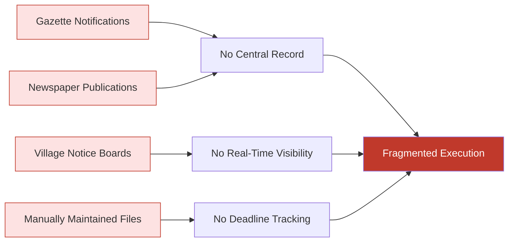
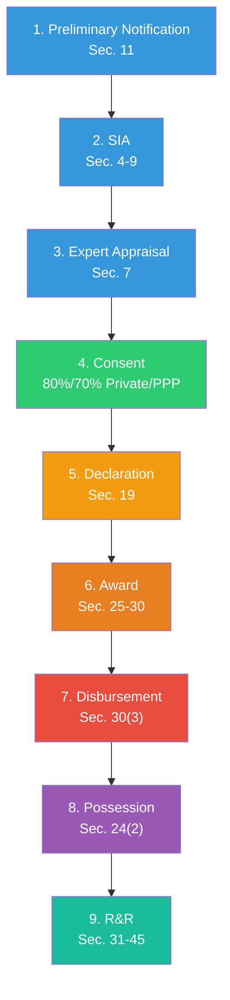
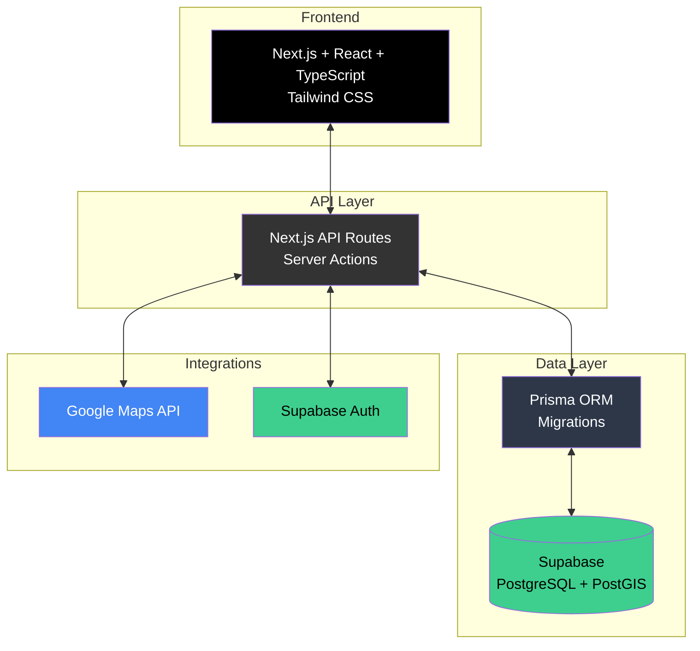

# Adhikar — National Land Acquisition & Management Command Center

<div align="center">


### Digitizing India's RFCTLARR Act, 2013 land acquisition process — end-to-end, in real time.

[](https://adhikar.tech)
[](https://youtu.be/8kwJE8ULGLo)
[](https://sih.gov.in)

**Problem Statement:** SIH26016 · Ministry of Rural Development · Team **ICARUS**

</div>

---

## 📌 The Problem

India's land acquisition process isn't broken by law — it's broken by execution.

The **Right to Fair Compensation and Transparency in Land Acquisition, Rehabilitation and Resettlement Act, 2013 (RFCTLARR)** is clear and well-defined, but its real-world execution runs through disconnected, manual channels: gazette notifications, newspaper publications, village notice boards, physical files, and manually maintained records.



> **35% of stalled highway projects** were delayed due to land acquisition disputes
> — *2025 Parliamentary Standing Committee Report, Ministry of Road Transport & Highways*

---

## 💡 The Solution

**Adhikar** is a national land acquisition and management command center that digitizes all **nine stages** of the RFCTLARR lifecycle into one unified, real-time platform.

> *"Digitize the paper trail and the statutory clock — not the land itself."*



Every statutory action is mapped to a digital system record:


---

## ✨ Key Features

| Feature | Description |
|---------|-------------|
| 🗺️ **GIS & Interactive Mapping** | Parcel-level visualization with risk-based color coding (on track / at risk / delayed / completed) |
| ⏱️ **Deadline Tracker & Alerts** | Automatic tracking of every statutory deadline with proactive notifications |
| 💰 **Transparent Compensation Engine** | Base land value + standing assets + solatium + rural factor + delay interest — fully auditable |
| 📊 **National Dashboard** | Real-time project counts, area notified vs. acquired, compensation disbursed, state-wise breakdown |
| 📄 **Automated Document Generation** | Gazette notifications, SIA reports, consent records, award statements, R&R reports (PDF/Excel export) |
| 🔐 **Role-Based Access Control** | Ministry (central), District Collector, Requiring Body, R&R Authority — with row-level security |
| 📝 **Full Audit Trail** | Every action logged: who, what, when, which stage, which document |

---

## 🏗️ Architecture



---

## 🛠️ Tech Stack

- **Frontend:** Next.js · React · TypeScript · Tailwind CSS
- **Backend:** Next.js API Routes (Server Actions)
- **Database:** Supabase (PostgreSQL + PostGIS for spatial data)
- **ORM:** Prisma (schema migrations, version-controlled)
- **Maps:** Google Maps API (geocoding & visualization)
- **Deployment:** Vercel (application) · Supabase (database & storage)
- **Security:** HTTPS · server-side authorization · row-level security (RLS) on all tables

---

## ✅ Feasibility

| Dimension | Why It Holds Up |
|-----------|-----------------|
| **Legal** | Built entirely on the existing RFCTLARR Act, 2013 — no new legislation required |
| **Technical** | Production-grade, widely-adopted stack — no experimental technology |
| **Economic** | Runs on free/low-cost infrastructure tiers at prototype stage — proves the model before scale spend |
| **Organizational** | Works within the existing government hierarchy — no restructuring required |

---

## 📈 Impact

- **₹6,603 Cr** — increase in costs across two BMRCL metro phases due to delays and incorrect estimates *(CAG Audit Report)*
- **₹186.8 Cr** — additional statutory interest linked to delayed final notification *(CAG Audit Report)*
- Full compensation transparency: every component of the final payout is visible and auditable to all stakeholders

---

## 📂 Project Structure

```
├── src/            # Application source code
├── prisma/         # Database schema & migrations
├── public/         # Static assets
├── DOCS/           # Domain research this app is built from
└── .env.local      # Environment configuration (Supabase project keys)
```

## 🚀 Getting Started

See [`DOCS/`](./DOCS) for full domain research and setup instructions, including manual Supabase configuration (PostGIS extension, database credentials, migrations).

---

## 👥 Team ICARUS

Built for **Smart India Hackathon 2026**

- Bhavesh Khatri
- Himesh Chaudhary
- Devansh Borana
- Akshit Dadhich
- Siya Sharma
- Yash Kumar

---

<div align="center">

### 🇮🇳 From Disputes to Development. A More Prosperous India.

</div>
